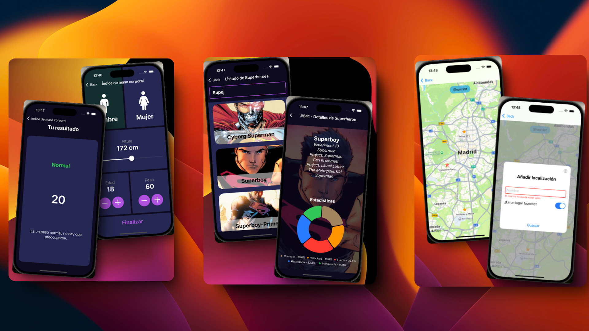

## APP 3 en 1 de iOS con SWIFT Y SWIFTUI

## Xcode

`IDE oficial` para `Swift`.
Creación de `folio en blanco` sin crear aun un proyecto solo un `Playground` en blanco (un fichero para hacer pruebas y ver resultados).

## Swift (`Components/SwiftEjemplo`)
* 1. Variables
- Operaciones
- Conversiones
* 2. Funciones
* 3. Sentencias If
* 4. Switch
* 5. Array
* 6. Bucles
* 7. Tuplas y diccionarios
* 8. Nulabilidad
* 9. Clases y Structs

## SwiftUI
Para organizar el código pillamos todo el código (`cmd + a`) y pulsamos (`ctrl + i`)
Para crear un fichero (`command + n`)
Para duplicar la línea (`comando + d`)
Para las ayudas de Apple (`option`)

* Componentes principales (`Components/...`):
- Componente `Text`
- Componente `Image`
- Componente `Slider`
- Componente `Label`
- Componente `Button`
- `@State` (son propiedades reactivas que permiten que las vistas de `SwiftUI` se actualicen automáticamente cuando cambian sus valores.)
- Componente `TextField`
- Componente `Toggle`

* Puntos interesantes de la `APP 3 en 1`:
1. `Menú de navegación` (paso de parámetros).
2. `Botones` (tipo toogle, contador, navegación).
3. `Slider`.
4. `TextField` (con validación del input y mostrando los errores).
5. `Listado` vertical y horizontal.
6. Llamada a `API` (incluido imágenes con librería).
7. `Gráfica` de quesitos.

8. `Mapas` de Apple (localización).
9. `Markers` (marcadores de localización).
10. `Diálogos personalizados` (alertas de confirmación o negación).
11. `Toggle`.
12. `Sheet` (son un tipo de vista modal que se superpone temporalmente a la vista actual).
13. `Persistencia` de datos en `UserDefaults`.

### 0. Ficheros generales ✅
* `Assets`: configuración de colores (AppBackground, ComponentBackground, SelectComponentBackground) e imágenes (youtube) como variables para utilizarlos en el proyecto de forma global.

* `_Curso_iOSApp`: es el punto de entrada de la App, donde configuro algunas de sus caracteristicas.

* `MainView`: es la `primera vista` (la principal), solo llama a la primera vista funcional que es el menu (MenuView).

* `MenuView`: es la primera `vista funcional`, donde se encuentra el `menú` para navegar a las aplicaciones (`IMC`, `SuperHeroe`, `Mis Sitios`).

### 1. IMC App ✅
* `IMCView`: vista principal de esta primera app para `configurar los datos del usuario` para poder calcular el IMC
    1. `IMCView`: vista principal
    2. `InformationText`: texto personalizado
    3. `ToogleButton`: sección botón personalizado (vista secundaria)
    4. `TitleText`: texto personalizado 2
    5. `CalculadorAltura`: sección con Slider personalizado (vista secundaria)
    6. `BotonContador`: botón contador
    7. `ContadorParametro`: sección de un contador con dos botones (vista secundaria)
    8. `BotonFinal`: sección con el boton para finalizar y navegar a la siguiente pantalla pasando parámetros (vista secundaria)

* `IMCResult`: vista secundaria que muestra el resultado del calculo IMC
    1. `IMCResult`: vista principal
    2. `calcularIMC`: función calcular el IMC (a partir de peso y altura)
    3. `formatoResultado`: función dar formato a una tupla con diversos datos de diferentes tipos según el resultado
    4. `InformationView`: Sección con todos los datos: estado (con color variante), resultado y descripción

[ HStack, VStack y ZStack ]
[ Navegación básica ]

### 2. SuperHeroe App ✅
* `ApiNetwork`: es una `clase` (no vista) donde se declara los modelos que se utilizan de la `API` y se hacen las llamadas a las `API`
[ API REST: `https://superheroapi.com/`  (KEY: XXXXXXXXX) ]
1. `Wrapper`: la estructura Wrapper que se recibe en el json de la API (tiene que ser Codable), ¡importante poner los mismos nombres que en JSON, (los que se quieran usar)!
2. `SuperHero`: la estructura SuperHero, los datos que recogemos para formar un superheroe en json (recordar poner los mismos nombres que en JSON)
3. `ImageSuperHero`: la estructura ImageSuperHero de la imagen del json
4. `SuperHeroComplete`: la estructura de SuperHeroComplete, es otra llamada a la API que devuelve otro json (recordar poner los mismos nombres que en JSON)
5. `Powestats`: la estructura de Powestats, con los poderes (recordar poner los mismos nombres que en JSON)
6. `Biograph`: la estructura de Powestats, con la biografia (problema con la etiqueta full-name en json que no se puede poner igual aqui en el script) (recordar poner los mismos nombres que en JSON)
7. `getHeroesByQuery`: función para obtener todos los heroes a través de un string
8. `getHeroeById`: función para obtener un heroe en particular

* `SuperHeroBuscador`: vista principal con la llamada de los superheroes en el listado con la capacidad de filtrarlos
[ LIBRERÍA: `https://github.com/SDWebImage/SDWebImage` (para poner una imagen sacada de una API)]
1. `SuperHeroItem`: sección con la información de un Superheroe (vista secundaria) que se mostrará en el Listado

* `SuperHeroDetails`: vista secundaria, que muestra en detalle a un solo superheroe con mas información que en el listado
1. `SuperHeroStats`: sección de las estadisticas del superheroe en una gráfica (vista secundaria)

[ Listas ]

### 3_Mis Sitios App ✅
* `SitiosFavoritos`: vista principal
Se muestra el `mapa`, al pulsar sobre el mapa se abre un `dialogo` para poder guardar el sitio (en fav o no) a través de un `formulario`. Tambien se encuentra en el mapa un `botón superpuesto` para poder a través de un `Sheet` ver en un `listado horizontal` tus lugares guardados y pulsando sobre uno de ellos redirigirse a el lugar en el mapa.
1. `savePlace`: función guardar (dentro de la estructura porque es para ella)
2. `clearForm`: función para limpiar el formulario y cerrar el Pop Up, una vez guardado
3. `animateCamera`: función que a través de unas coordenadas te redirige a la posición en el mapa.

* `CustomDialog`: vista secundaria en vista principal, construcción del `dialogo` para la vista principal.
Se llama tanto a los elementos del `dialogo (Content)`, asi es o no pulsable en toda la página, como a la función para cerrar el dialogo.

* `Place`:
1. `enum CodingKeys`:  Define las claves que se usarán al codificar o decodificar el objeto.
2. `init(id:UUID = UUID(), name: String, coordinates: CLLocationCoordinate2D, fav: Bool)`: contructor normal
3.  `init(from decoder: Decoder) throws`: contructor especial para poder decodear (obtiene un contenedor de claves para extraer valores del JSON)
4. `encode(to encoder: any Encoder) throws`: función especial para codificar (crea un contenedor para guardar valores en formato JSON)

* `DB_UserDefaults` (`extension SitiosFavoritos`): funciones referidas a la llamada a la BD, son extensiones que obtienen todos las variabels y funciones del la vista `SitiosFavoritos`, pero al ponerlas aqui es mas escalable y más limpio
1. `guardarPlaces()`: almacenar en la db los sitios (Place)
2. `cargarPlaces()`: obtener del db los sitios ([Place])

Con User Defaults (muy básica DB) (para borrar la DB seria borrando la App dentro del Iphone (emulador))

[ Mapas ]

